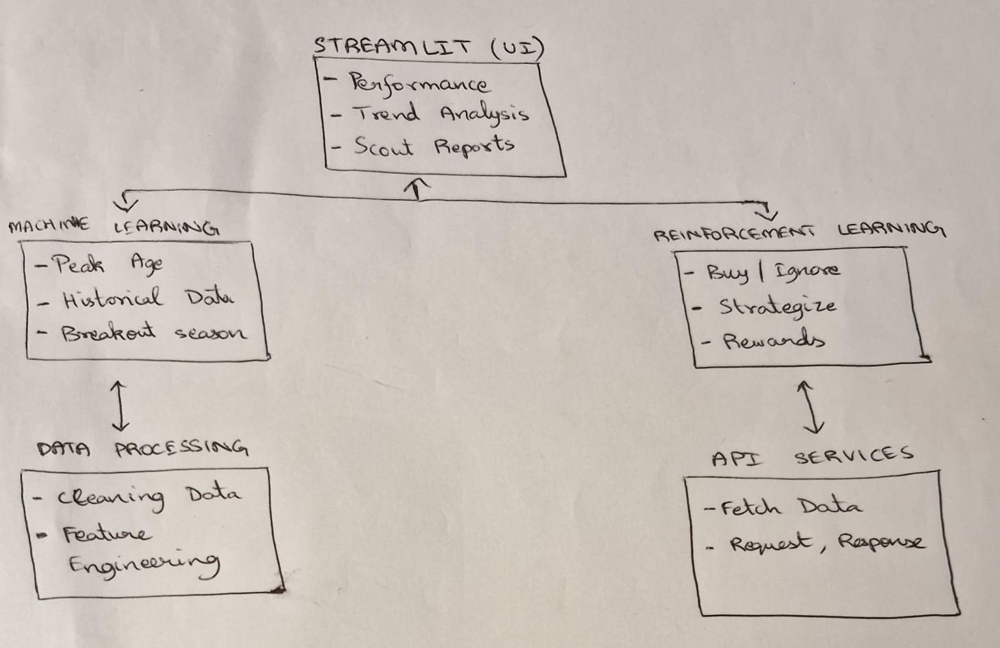

# Football Analytics Platform

## Overview

The **Football Analytics Platform** is a **Streamlit-based web application** designed to **analyze player career trajectories, predict peak performance age, and optimize scouting decisions** using **Machine Learning and Reinforcement Learning**.

With **data spanning 7 seasons**, this platform helps clubs, analysts, and scouts **identify prime-age players, detect career trends, and simulate scouting decisions** to maximize **transfer value and team performance**.

---

## Component Specifications

### **1️⃣ User Interface (Streamlit UI)**

**Description:**  
The front-end interface where users interact with the platform to analyze player performance, predict peak age, and receive scouting recommendations.

**Responsibilities:**

- Allow users to **select players from teams and leagues** for analysis.
- Display **player trajectory graphs and peak-age predictions**.
- Provide **scouting recommendations** based on RL agent decisions.

**Input:**

- Player selection
- Position, league, and season range
- Scouting decision request

**Output:**

- Player performance graphs
- Peak age prediction results
- Scouting recommendations (Buy, Scout, Ignore)

---

### **2️⃣ Data Processing**

**Description:**  
Handles **data ingestion, cleaning, and transformation** for analysis.

**Responsibilities:**

- Load and preprocess **7-season player datasets**.
- Standardize **features across seasons** for consistency.
- Compute **rolling averages and breakout season detection**.
- Store processed data for **ML & RL model usage**.

**Input:**

- Raw player statistics (CSV).

**Output:**

- Cleaned dataset with peak-age features.
- Transformed data for ML and RL models.

---

### **3️⃣ Machine Learning Model for Peak Age Prediction**

**Description:**  
Predicts when a player is expected to reach **peak performance** based on past trends.

**Responsibilities:**

- Train an **ML model (Random Forest/XGBoost/LSTM)** to predict peak age.
- Use **position-specific metrics** to detect peak seasons.
- Identify **breakout performances** and smooth out noise.

**Input:**

- Cleaned player performance dataset (past 7 seasons).

**Output:**

- Predicted **peak age** for each player.
- Confidence scores for predictions.

---

### **4️⃣ Reinforcement Learning Model for Scouting**

**Description:**  
Trains an **RL agent** to optimize **scouting & transfer decisions** based on performance trends.

**Responsibilities:**

- Define **state space** with player’s 7-season history.
- Implement **actions:** `Scout`, `Buy`, `Ignore`.
- Optimize **reward function** to maximize scouting efficiency.
- Simulate **club transfer policies** and **contract decisions**.

**Input:**

- Processed player stats with trajectory trends.

**Output:**

- **Scouting recommendation:** Buy, Scout, Ignore.
- **Projected player value growth/decline.**

---

### **5️⃣ API Layer**

**Description:**  
Provides an **external API** for apps to fetch **player insights & scouting recommendations**.

**Responsibilities:**

- Authenticate external requests using **API keys**.
- Allow **external systems** to request player insights.
- Return **JSON-formatted player data** for integration.

**Input:**

- API key
- Player name, position, season

**Output:**

- JSON response with:
  - **Peak age prediction**
  - **Player trajectory trends**
  - **Scouting recommendations**

---

## System Architecture

### Architecture Diagram

The system follows a **modular design**, ensuring **scalability and efficiency**.

