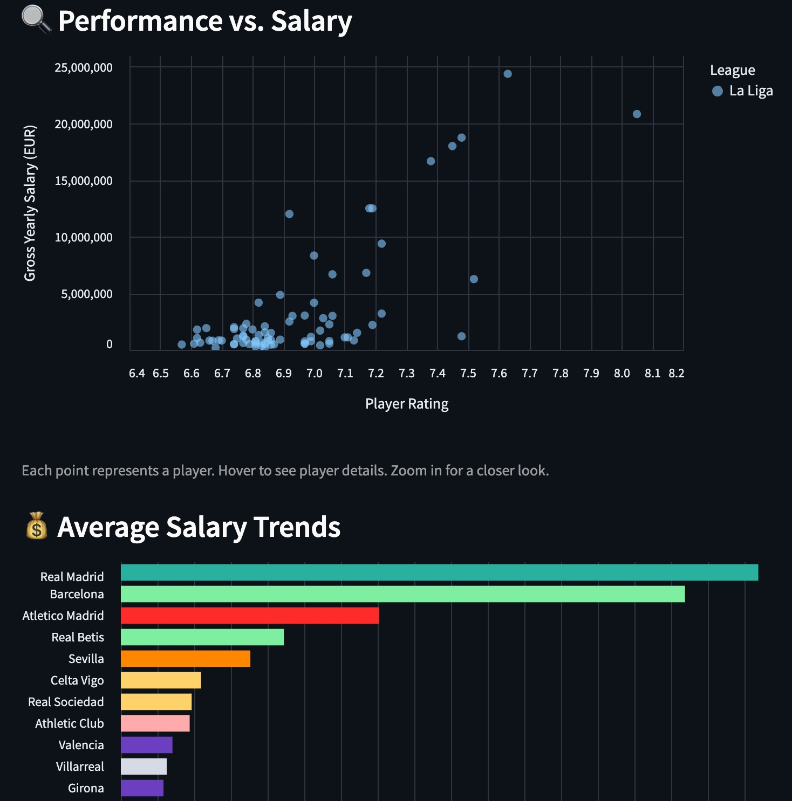
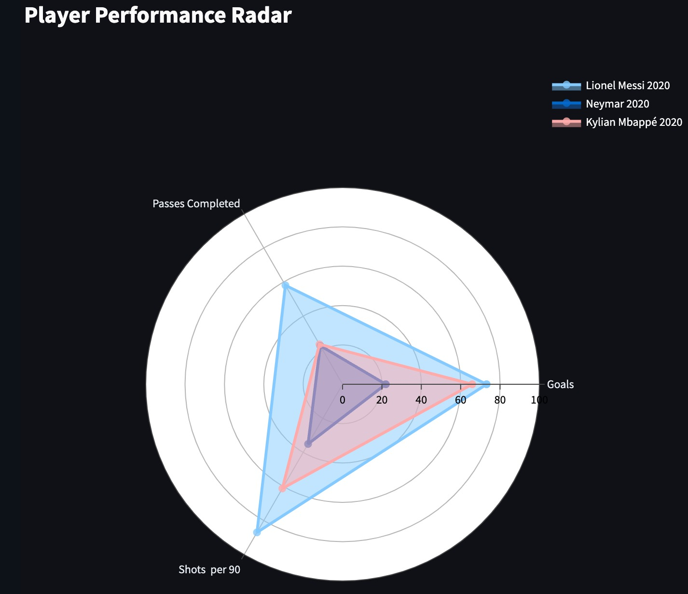
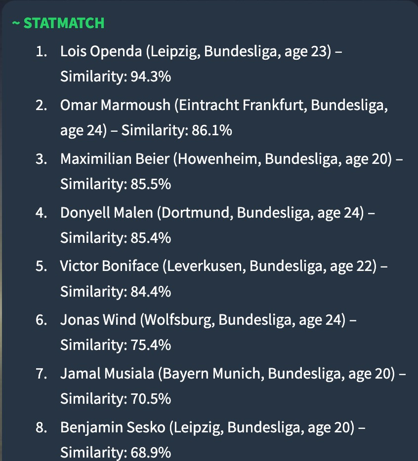
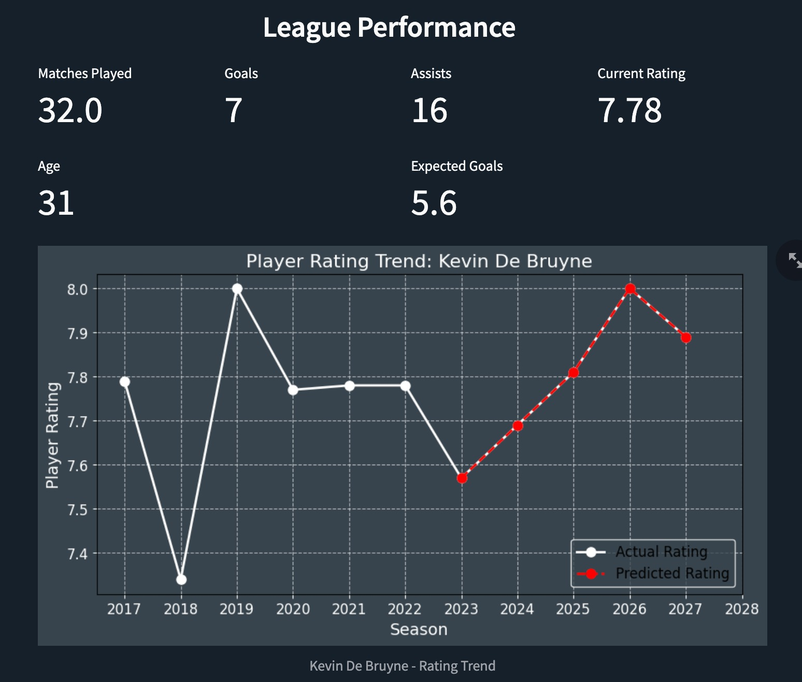

**Home Page**
------------------

Before you begin, read the **"Tutorial For Using the Tool"** section in the README.

Launch the PeakPerformance dashboard by running:

Navigate through the sidebar menu to access different features.

**EDA & Salary Analysis**
----------------------------

### **Exploring Player Salaries**

1.  Go to **EDA & Salary Analysis**.
    
2.  Use dropdown filters to select:
    
    *   **League** (e.g., Premier League)
        
    *   **Position** (e.g., Forward)
        
    *   **Club** (e.g., Manchester United)
        
3.  Observe:
    
    *   **Scatter Plot:** Player Rating vs. Salary.
        
    *   **Salary Distribution Chart:** Wage disparities in different leagues.
        

#### Example:

If you select **"La Liga"** and **"Midfielders"**, you'll see an average salary comparison among midfielders.

**Player Performance Radar**
--------------------------------

### **Comparing Players Across Metrics**

1.  Navigate to **Player Performance Radar**.
    
2.  Select **1–10 players** from the dropdown.
    
3.  Choose metrics (e.g., Goals, Passes, Shots).
    
4.  A **radar chart** will display for side-by-side analysis.
    

#### Example:

*   Comparing **Messi, Neymar, and Mbappé** across **Goals, Passes Complete, and Shots per 90**.
    

**Player Similarity Matching**
---------------------------------

### **Finding Similar Players**

1.  Navigate to **Player Similarity Matching**.
    
2.  Enter a query in the search bar:
    
3.  The AI model will return the most similar players.
    

#### Example Queries:
    
*   "Top 10 players similar to 2017 Cristiano Ronaldo in the 2023 Bundesliga season under 25."
    

**Player Profile Lookup**
----------------------------

### **Viewing Player Statistics & Predictions**

1.  Enter a **player’s name** in the search bar.
    
2.  The system retrieves:
    
    *   **Historical Performance** (rating trends).
        
    *   **Predicted Future Ratings**.
        
    *   **Player details** (age, position, nationality).
        

#### Example:

*   Searching "Kevin De Bruyne" displays his **career progression and future rating projections**.
    
